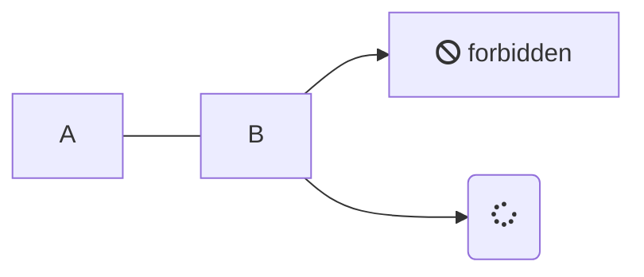

# rushdown-diagram
rushdown-diagram is a diagram plugin for [rushdown](https://github.com/yuin/rushdown), a markdown parser. 
It allows you to easily embed diagrams in your markdown documents.

## Installation
Add dependency to your `Cargo.toml`:

```toml
[dependencies]
rushdown-diagram = "x.y.z"
```

## Syntax
Currently, rushdown-diagram supports only mermaid diagrams and client-side rendering. 
You can use the following syntax to embed a mermaid diagram:

`````markdown

`````

## Usage
### Example

`````rust
use core::fmt::Write;
use rushdown::{
    new_markdown_to_html,
    parser::{self, ParserExtension},
    renderer::html::{self, RendererExtension},
    Result,
};
use rushdown_diagram::{diagram_parser_extension, diagram_html_renderer_extension, DiagramHtmlRendererOptions};

let markdown_to_html = new_markdown_to_html(
    parser::Options::default(),
    html::Options::default(),
    diagram_parser_extension(),
    diagram_html_renderer_extension(DiagramHtmlRendererOptions::default()),
);
let mut output = String::new();
let input = r#"

"#;
match markdown_to_html(&mut output, input) {
    Ok(_) => {
        println!("HTML output:\n{}", output);
    }
    Err(e) => {
        println!("Error: {:?}", e);
    }
}
`````

## Donation
BTC: 1NEDSyUmo4SMTDP83JJQSWi1MvQUGGNMZB

Github sponsors also welcome.

## License
MIT

## Author
Yusuke Inuzuka
